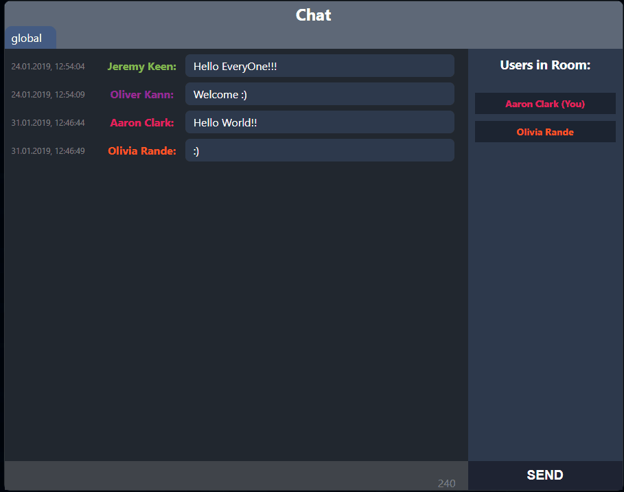
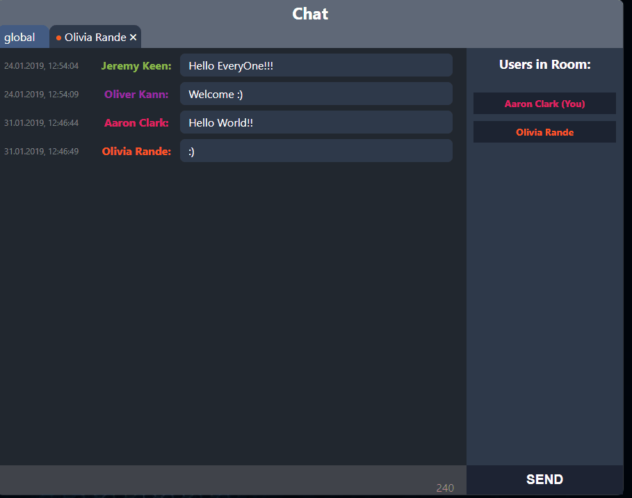

Demo - https://chat-socket-io-ex.herokuapp.com/

## Available Scripts

`./chat-app` - CLIENT code and CRA dev server (React.js, SocketIO)  
`./chat-app/server` - SERVER code (NodeJS, SocketIO, Mongo)

### RUN CLIENT APP

In the directory run `./chat-app` install packages via `yarn` or `npm install`

`npm start` or `yarn start`

Runs the app in the development client mode.
Open [http://localhost:3000](http://localhost:3000) to view it in the browser.

The page will reload if you make edits.
You will also see any lint errors in the console.

### RUN API SERVER

`cd ./server` and `yarn` or `npm install` then `yarn start` or `npm start`

Launches the server of socket io based app on NodeJS with DB connection;

## FEATURES

-   Ability to chose color of your name in chat
    

-   Global window chat - sending messages to all users that are currently online
    

-   Private chat - by left click on username on the right sidebar (it will create a new tab with private chat)
    
    

-   Mobile Friendly

    
